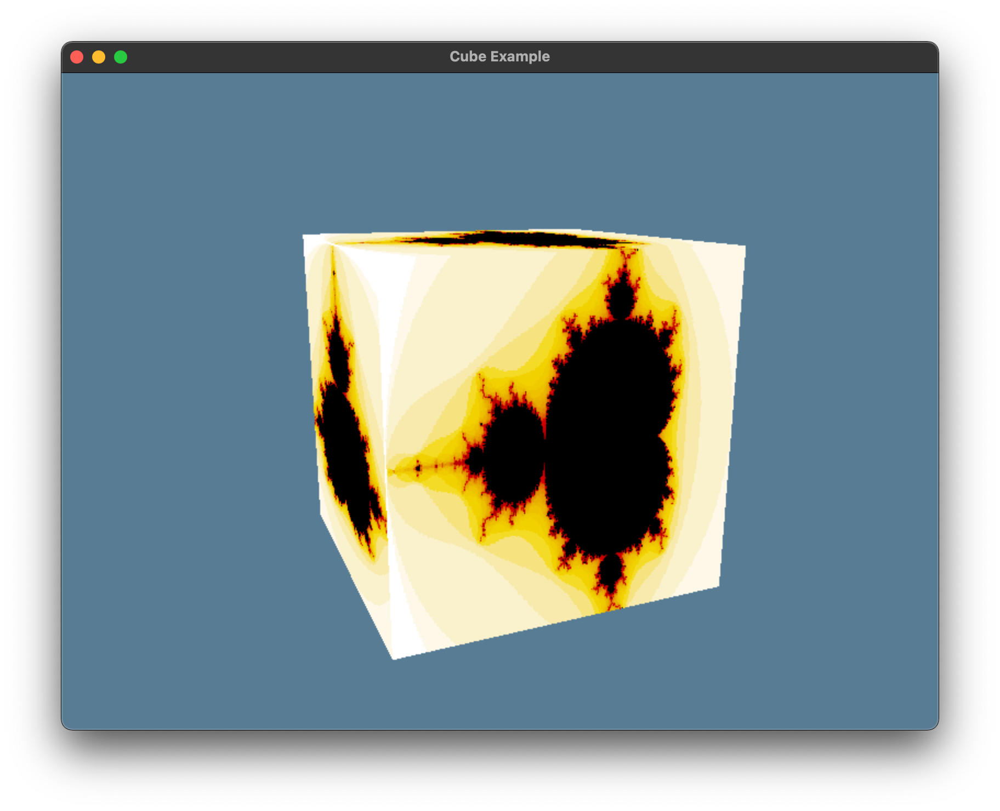

# Haskell Bindings for WebGPU Native

[![Hackage][hackage-shield]][hackage]
[![CI Build][github-ci-shield]][github-ci]
[![License BSD-3-Clause][license-shield]][license]
![Platforms][platform-shield]

[hackage]: http://hackage.haskell.org/package/wgpu-hs
[hackage-shield]: https://img.shields.io/hackage/v/wgpu-hs.svg?logo=haskell
[github-ci]: https://github.com/lancelet/wgpu-hs/actions
[github-ci-shield]: https://github.com/lancelet/wgpu-hs/actions/workflows/ci.yml/badge.svg
[license]: https://github.com/lancelet/wgpu-hs/blob/master/LICENSE
[license-shield]: https://img.shields.io/badge/license-BSD--3--Clause-green.svg
[platform-shield]: https://img.shields.io/badge/platform-macos%20%7C%20linux%20%7C%20windows-blue

This repository contains Haskell bindings for
[wgpu-native](https://github.com/gfx-rs/wgpu-native).

macOS, Windows and Linux are supported. SDL2 and GLFW are both supported as
windowing systems.

To get started, please read the [Getting Started](GettingStarted.md)
instructions.

