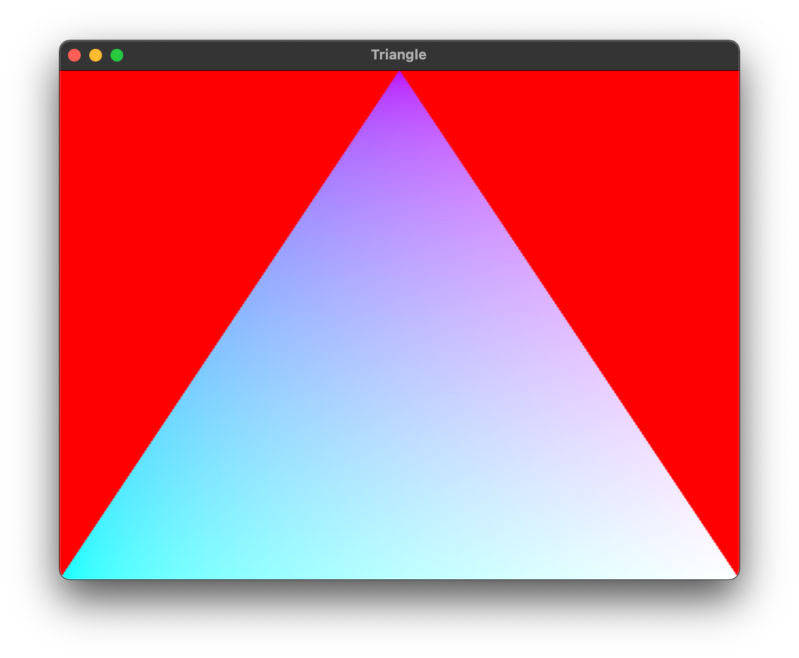

# wgpu-hs - Haskell Bindings for wgpu-native

This repository contains Haskell bindings for
[wgpu-native](https://github.com/gfx-rs/wgpu-native).
These bindings are in an early stage of development and are not yet stable.

[WebGPU](https://en.wikipedia.org/wiki/WebGPU) is a future web standard for a
next-generation accelerated graphics and compute API, developed by W3C.
`wgpu-native` is a C binding to a native version of a similar API, that can be
compiled natively, and used outside a web browser.

Two practical open-source implementations of WebGPU exist:
  1. [wgpu-native](https://github.com/gfx-rs/wgpu-native) from "Rust Graphics
     Mages" (gfx-rs), and
  2. [dawn](https://dawn.googlesource.com/dawn) from Google.
  
Currently, only `wgpu-native` is targeted by these bindings. In the future, a
shared, complete C API may be supported by both packages, but since such a
complete API does not yet exist, only the Rust version can be expected to work
at the moment.

Currently, only macOS is supported by these Haskell bindings. Adding other
platforms should be relatively trivial but requires testing.

## Summary of Packages

There are three different packages in this repository:

  1. `wgpu-raw-hs-codegen`: Generates most of the code for `wgpu-raw-hs`.
  2. `wgpu-raw-hs`: Low-level, C-like bindings to the `wgpu-native` API.
  3. `wgpu-hs`: Higher-level, Haskell-like bindings.

## Building and Running

You will need a working Rust toolchain.

To build and run an example:

  1. Clone the repository and make sure that all git submodules are checked
     out:
     
     ```
     git clone https://github.com/lancelet/wgpu-hs.git
     cd wgpu-hs
     git submodule update --init --recursive
     ```
       
  2. Build the Rust libraries. The `WGPU_NATIVE_VERSION` environment variable
     is optional, but if it is supplied, it bakes the specified version number
     into the dynamic library binary.
  
     ```
     pushd wgpu-raw-hs-codegen/wgpu-native
     WGPU_NATIVE_VERSION='v0.9.2.2' make lib-native
     popd
     ```
     
  3. Set `LD_LIBRARY_PATH` to include the Rust libraries that were just built.
     The Rust build steps will have produced a dynamic library, called
     `libwgpu_native.dylib` on macOS. The example code loads this library at
     runtime. `LD_LIBRARY_PATH` is a standard environment variable that allows
     the system dynamic loader to find the library.
  
     ```
     export LD_LIBRARY_PATH=$(pwd)/wgpu-raw-hs-codegen/wgpu-native/target/debug/:$LD_LIBRARY_PATH
     ```
     
  4. Build and run the `triangle` example:
  
     ```
     export METAL_DEVICE_WRAPPER_TYPE=1
     cabal run triangle
     ```
     
     The environment variable `METAL_DEVICE_WRAPPER_TYPE` enables Metal API
     validation.
     
If everything went well, you should see the initial triangle demo:


